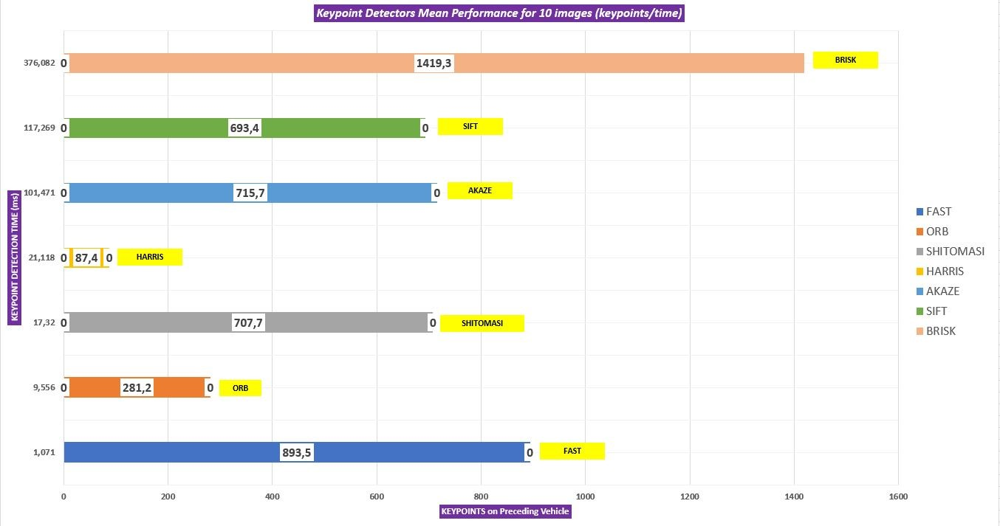

# SFND 2D Feature Tracking


The idea of the camera course is to build a collision detection system - that's the overall goal for the Final Project. As a preparation for this, you will now build the feature tracking part and test various detector / descriptor combinations to see which ones perform best. This mid-term project consists of four parts:

* First, you will focus on loading images, setting up data structures and putting everything into a ring buffer to optimize memory load. 
* Then, you will integrate several keypoint detectors such as HARRIS, FAST, BRISK and SIFT and compare them with regard to number of keypoints and speed. 
* In the next part, you will then focus on descriptor extraction and matching using brute force and also the FLANN approach we discussed in the previous lesson. 
* In the last part, once the code framework is complete, you will test the various algorithms in different combinations and compare them with regard to some performance measures. 

See the classroom instruction and code comments for more details on each of these parts. Once you are finished with this project, the keypoint matching part will be set up and you can proceed to the next lesson, where the focus is on integrating Lidar points and on object detection using deep-learning. 

## Dependencies for Running Locally
* cmake >= 2.8
  * All OSes: [click here for installation instructions](https://cmake.org/install/)
* make >= 4.1 (Linux, Mac), 3.81 (Windows)
  * Linux: make is installed by default on most Linux distros
  * Mac: [install Xcode command line tools to get make](https://developer.apple.com/xcode/features/)
  * Windows: [Click here for installation instructions](http://gnuwin32.sourceforge.net/packages/make.htm)
* OpenCV >= 4.1
  * This must be compiled from source using the `-D OPENCV_ENABLE_NONFREE=ON` cmake flag for testing the SIFT and SURF detectors.
  * The OpenCV 4.1.0 source code can be found [here](https://github.com/opencv/opencv/tree/4.1.0)
* gcc/g++ >= 5.4
  * Linux: gcc / g++ is installed by default on most Linux distros
  * Mac: same deal as make - [install Xcode command line tools](https://developer.apple.com/xcode/features/)
  * Windows: recommend using [MinGW](http://www.mingw.org/)

## Basic Build Instructions

1. Clone this repo.
2. Make a build directory in the top level directory: `mkdir build && cd build`
3. Compile: `cmake .. && make`
4. Run it: `./2D_feature_tracking`.


# My Project Report

## Task MP.1 : Data Buffer
For data buffer implementation, I created ring buffer data structure. My buffer size is 3 (dataBufferSize=3).
```c++
int intImageIndex = static_cast<int>(imgIndex); 
if((intImageIndex%dataBufferSize) == intImageIndex)
{
dataBuffer.insert(dataBuffer.end(),frame);
}
else
{
dataBuffer.erase(dataBuffer.begin());
dataBuffer.insert(dataBuffer.end(),frame);
}   
```
When result of modulation operator is not equal to image index ( e.g 4%3!=1) it means buffer is filled. Then Process continues by deleting the oldest element of buffer and adding new element to the end of buffer.

## Task MP.2 : Keypoint Detection
I have created distinct functions for each keypoint detectors. Because I was planned to play with parameters of each keypoint detectors. But some parameters gave errors which I thought that was bugs in OpenCV (for example diffusivity argument of function of AKAZE keypoint detector). Then I called functions of each keypoint detectors (except Harris and Shitomasi) by using their names (detectorType argument).

```c++
detKeypointsModern(keypoints,imgGray, detectorType, false);
```

I implemented different function for Harris detector.
```c++
detKeypointsHarris(keypoints,imgGray,false);
```

## Task MP.3 : Removing Keypoints Outside of Bounding Box
I checked  keypoints is inside bounding box or not, using for loop. If coordinate of a keypoint doesn’t inside a bounding box it will be erase from the keypoint vector. Then reassign the updated vector to keypoint vector.
```c++
vector<cv::KeyPoint> keyPointsOnVehicle = keypoints; 
for (int kpIndex = 0; kpIndex < keyPointsOnVehicle.size(); kpIndex++)
    {
       float kpX = keypoints.at(kpIndex).pt.x;
       float kpY = keypoints.at(kpIndex).pt.y;
       float rectTopLeftX = (float)vehicleRect.x;
       float rectTopLeftY = (float)vehicleRect.y;
       float rectWidth = (float)vehicleRect.width;
       float rectHeight = (float)vehicleRect.height;
    //if a keypoint doesn't belong to preceding vehicle, remove it from vector
    if((rectTopLeftX > kpX) || (kpX > (rectTopLeftX + rectWidth)) || (rectTopLeftY > kpY) || ( kpY> (rectTopLeftY + rectHeight)))
       {
         keyPointsOnVehicle.erase(keyPointsOnVehicle.begin() + kpIndex);
       }
     else
       {
         continue;
       }
    }

keypoints = keyPointsOnVehicle;
```


## Task MP.4 : Keypoint Descriptors
I implemented all descriptors which selectable using respective names in descKeypoints function (matchingStudent.cpp).
```c++
void descKeypoints(vector<cv::KeyPoint> &keypoints, cv::Mat &img, cv::Mat &descriptors, string descriptorType)
```

I assigned respective descriptor to variable which type is cv::DescriptorExtractor according to descriptorType parameter.
```c++
cv::Ptr<cv::DescriptorExtractor> extractor;
```

## Task MP.5 : Matching Keypoints
I created FLANN based descriptor which selectable using “MAT_FLANN”  string.
```c++
matcher = cv::DescriptorMatcher::create(cv::DescriptorMatcher::FLANNBASED);
```
However before doing that, I converted source and reference Mat files  from 8 bit array to 32 bit float array using CV_32F keyword. Because some versions of OpenCV have bugs.
```c++
if(descRef.type() != CV_32F)
        {
            descRef.convertTo(descRef,CV_32F);
        }
        if(descSource.type() != CV_32F)
        {
            descSource.convertTo(descSource,CV_32F);
        }
```

## Task MP.6 : KNN Matcher and Descriptor Distance Ratio
I implemented KNN matcher with value of k is 2;
```c++
matcher->knnMatch(descSource, descRef, knnMatches, 2);
``` 
Then I created if statements and check the "sum of squared distance" ratio (L2-distance) between two best matches using ratio_threshold is  lower than 0.8 . 
```c++
const float ratio_threshold = 0.8f;
vector<vector<cv::DMatch>> knnMatches;
matcher->knnMatch(descSource, descRef, knnMatches, 2);
//filter matches using descriptor distance ratio test
for (int i = 0; i < knnMatches.size(); i++)
{
if(knnMatches[i][0].distance < (ratio_threshold * knnMatches[i][1].distance))
{
   matches.push_back(knnMatches[i][0]);
}
}
```

## Task MP.7 : Keypoint Detection Performance


I mentioned count of detected keypoints only on preceding vehicle and their respective executing times. FAST keypoint detector is the best in my work. Please see “keypointDetection.xlsx” file in my submission for detailed data.

## Task MP.8 : Matching Keypoints Performance
I took notes about matching keypoints in “matches.xlsx” file in my submission. SIFT descriptor only works with FLANN method and AKAZE descriptor only works with AKAZE detector.

## Task MP.9 : Time Analysis of Detectors/Descriptors
According to count of matching keypoints and time performance, I have decided to my TOP 3 detector/descriptor combination;
  Detector/Descriptor
1)FAST/ORB
2)FAST/BRIEF
3)FAST/BRISK

